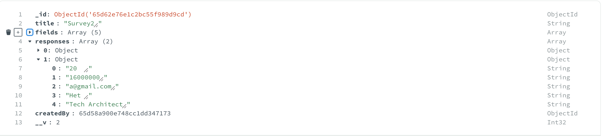
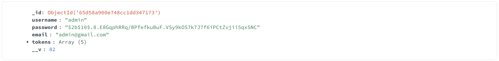

# Forms-builder

To Start the application:

# Starting the Backend

In the project root directory, run:

### `cd backend`

### `node src/app.js`

This would start the backend server at PORT 8000.

# Starting the Frontend

Now, after successfully starting the backend, go to root directory, and run:

### `cd frontend`

### `npm start`

This would start the frontend application at PORT 3000.

Runs the app in the development mode.\
Open [http://localhost:3000](http://localhost:3000) to view it in your browser.

# Application Details:

There is an authentication setup, where you are required to add a unique username, an email and a password.

After that you get redirected to the HomePage, where you are shown the list of forms designed by you. You can preview a form or see the responses on a form using the buttons provided.

There is an option to build a new form from where you can design a new form.
A form can have Text, Number or Email as an input, and we can set required true/false for the fields of form.

Unique links are designed for each form, for submission of responses. The responses are being stored in the forms documents.

For Eg. if my form Id is : 65d62e76e1c2bc55f989d9cd
then, the form response will be available on this URL: http://localhost:3000/api/forms/65d62e76e1c2bc55f989d9cd/submit

The user doesn't require to sign in if he/she wants to just give response to a form using a link, else the user can't go further to website to other pages without a successful login.

There is a Logout option in the Navigation Bar, which logs out the user by removing the token stored.

This is how responses are stored in forms document

This is how user details are stored

